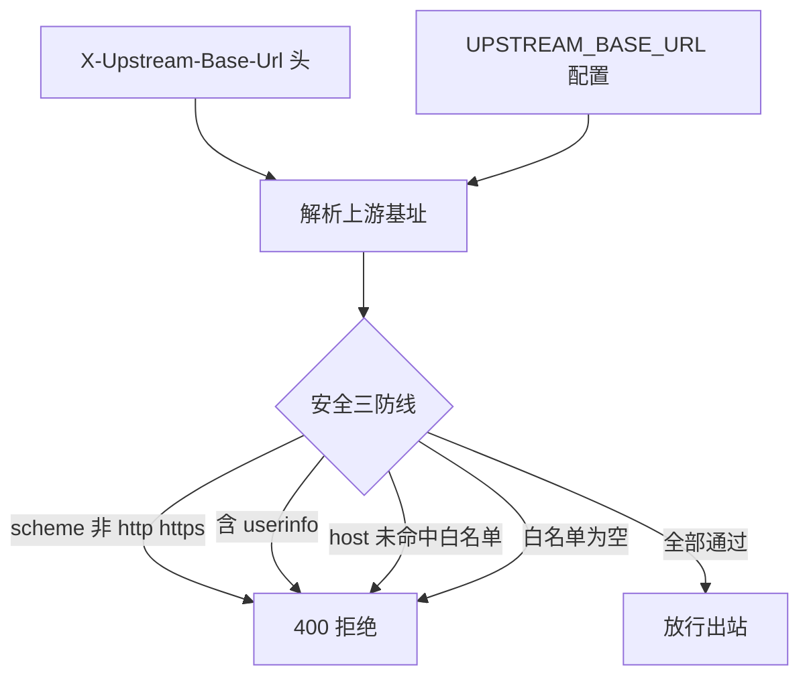
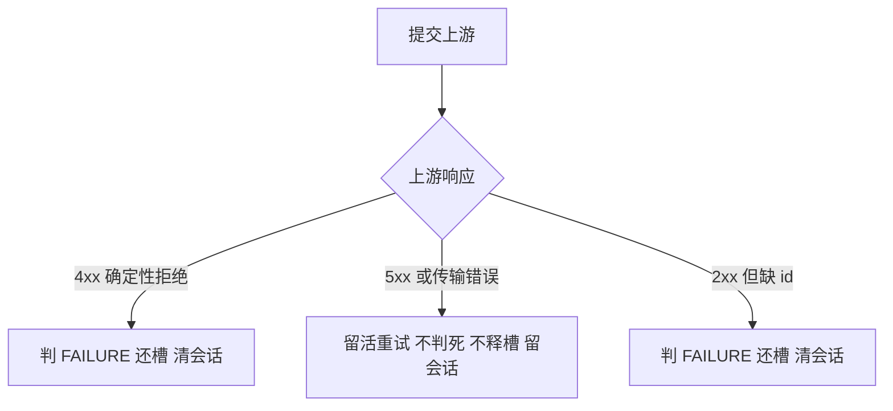
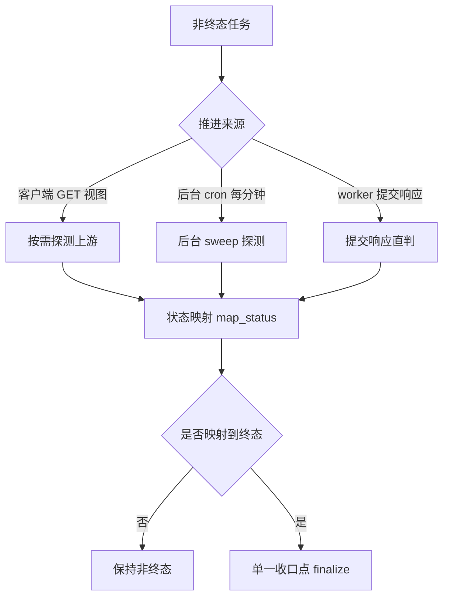
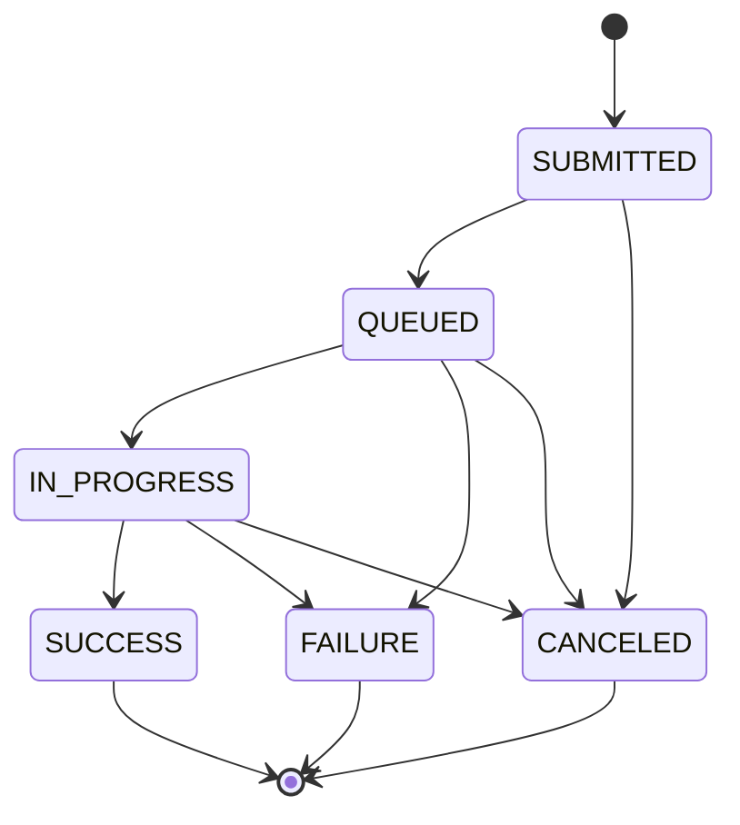

# 架构总览 — `/queue` 中继生命周期

**版本**：v2.0　**日期**：2026-09-12　**状态**：现行
**上位决策**：本仓库 ADR-010（对外形态统一为 `/queue/{上游路径}`，鉴权与计费全部下沉上游）
**取代**：本文件 v1.0（异步任务全生命周期与资金安全）**整篇作废**——它描述的渠道元数据、
任务级精确直达、资金动作三档与失败五级分流，其载体模块已随本仓库 ADR-010 整体删除，
留在文档里比删掉更危险。

> 本文是**现行**架构的唯一总览：对外形态、鉴权与计费边界、上游寻址、受理异步化、
> 终态收敛、单一终态收口点、失败三档、共享表纪律、已知限制。
> 契约细节看 `docs/SPEC.md`；决策取舍看 `docs/decisions/`；性能口径看 `docs/perf-regression.md`。
> 体例参照 stask-service 的 `docs/ARCH-scheduling-and-concurrency.md`：每块按
> 「问题 → 方案 → 不变量 → 失败模式」写，配 Mermaid 图。

## 0. 结论摘要

- **对外只有一个形态**：`POST /queue/{path}`（受理）、`GET /queue/{path}/{task_id}`（查询）、
  `DELETE /queue/{path}/{task_id}`（取消）。`{path}` 是**上游原生路径**，不是网关自定义路由。
- **鉴权不内省**：用户 token 以 `Authorization: Bearer <token>` **原样透传上游**，由上游判定
  有效性；网关只做本地限流、幂等、并发上限。用户 token 只进 Redis 会话，绝不落库。
- **计费零资金动作**：网关不持有上游 key、不做任何额度操作，配额由上游 relay 扣减；
  `tasks.data` 里**没有**任何资金字段（本仓库 ADR-010 §3）。
- **上游寻址按请求**：`X-Upstream-Base-Url` 头优先，回退 `UPSTREAM_BASE_URL`，host 必须命中
  `UPSTREAM_ALLOWLIST`（空即全拒）。头的可信性**完全依赖 nginx 无条件覆盖**。
- **受理异步化**：`POST /queue/{path}` 落库即返回（客户端侧零上游往返），上游提交交 worker
  （`queue_submit_task`）。
- **终态收敛**：客户端 GET 按需探测 + 后台 `queue_sweep_task`（cron 每分钟、独立重入锁、
  最旧优先）兜底；用户回调由 `X-Callback-Url` 驱动，终态时签名投递。
- **单一终态收口点** `_finalize_queue`：快照落库、还并发槽、投递回调、清令牌会话，多条路径
  共用同一份实现，绝不各写一套。
- **失败三档**（取代旧五级）：4xx 判死、5xx 与传输错误**留活重试**、2xx 缺 id 判死。

## 1. 全局视图

```mermaid
flowchart LR
    C[客户端] --> N[nginx 反代]
    N -->|queue 前缀| G[网关 app]
    N -->|其余路径| U[上游 new-api]
    G -->|Bearer 令牌透传| U
    G --> R[Redis 会话与计数]
    G --> D[tasks 表]
    G --> Q[Redis 任务队列]
    Q --> W[taskiq worker]
    W -->|原样转发| U
    S[scheduler 每分钟] --> W
```

- **nginx** 是唯一总入口，`/queue/` 前缀转发本网关、其余转发上游；它**无条件覆盖**
  `X-Upstream-Base-Url` 头（防伪造的第一道防线，见 §6）。
- **网关 web 进程**（`app/main.py`）只做同步段：限流、幂等、并发占槽、寻址校验、落库、
  入队、返回 `202`。**请求内零上游往返**。
- **taskiq worker 进程**（`app/queue.py`）承担全部出站：上游提交（`queue_submit_task`）、
  用户回调（`notify_task`）；**scheduler** 承担每分钟收敛（`queue_sweep_task`）。
- **Redis** 只放「丢了能重建」的状态：限流计数、幂等键、并发槽、令牌会话、收敛重入锁、
  队列与死信（`app/redis.py` 的键规范）。
- **tasks 表**是任务事实源，与 new-api 共享实例与表，网关零建表职责（见 §11）。

## 2. 对外形态：`/queue/{path}` 三件套

### 问题

旧形态把「业务」编进 URL：`/{biz}/v1/tasks` 等三种写法。`biz` 是渠道入口标签，但**选渠道
一直只依赖 body 里的 `model`**——URL 段不携带上游真正需要的信息，却让每新增路径都要网关配合。

### 方案

路由只有三个方法，全部落在 `app/routers/queue_task.py`，语义全在 `app/services/relayflow.py`：

| 方法 | 路径 | 语义 | 实现入口 |
|---|---|---|---|
| `POST` | `/queue/{path}` | 受理上游异步任务 | `relayflow.create_queue_task` |
| `GET` | `/queue/{path}/{task_id}` | 查询本地任务 | `relayflow.view_queue_task` |
| `GET` | `/queue/{path}` | 免费透传（末段不是本地 id） | `relayflow.free_queue_get` |
| `DELETE` | `/queue/{path}/{task_id}` | 取消本地任务 | `relayflow.cancel_queue_task` |

- **`{biz}` 段从 URL 彻底消失**（本仓库 ADR-010 §1）：去掉不丢信息，选渠道只依赖 `model`。
- **不做任何旧形态兼容**（用户明确要求「无需兼容旧版本」）：旧路径不保留、不重定向。
- `POST` 统一 `202 + {task_id, status}`，带 `Location: /queue/{path}/{task_id}` 头。
- `GET` / `DELETE` 用**最后一段**判定：`nativeapi.is_local_id()` 命中 `LOCAL_ID_RE`
  （`{slug}_{uuid4hex}`）才当本地任务，否则 `GET` 走免费透传、`DELETE` 返回 404。
- `{path}` 落库前经 `ensure_path_allowed` 检查硬拒前缀（`QUEUE_DENY_PREFIXES`，默认
  `/api/,/console/`），命中即 `403`——防止把上游管理面/控制台经本网关暴露。

**两层前缀**（本仓库 ADR-010 §1）：**对外统一 `/async`**（与 stask 一致，客户端只记
一个），由 nginx 按路径分流（同步类路径 → stask，其余 → 本服务并重写为内部前缀）；
**网关内部是 `/queue/{上游原生路径}`**，与机制名同源（`data.source='queue'`、
`queue_*` 词根、`task_id` 前缀）。分流表在 nginx，**接入新上游要多写一条 `location`**，
兜底应 fail-closed（漏配响亮拒绝，别甩给某个服务）。

### 不变量

1. 路由层**只做分派与响应塑形**，不碰 DB、不出站（分层约定，本仓库 ADR-009）。
2. `/queue/{path:path}` 是**唯一通配路由，必须最后注册**——Starlette 按注册顺序首匹配，
   通配若排在 `/healthz/*`、`/ops/*`、`/admin/*` 之前会整片吞掉它们且不报错；由静态门禁
   `tests/test_static_gates.py` 机械保证。
3. `GET` 免费透传**绝不产生任何本地任务事实**（不落 tasks 行、不占并发槽）。
4. 免费透传必须**透传上游 `Content-Type`**，可能是图片/二进制产物，绝不硬写 JSON。

### 失败模式

| 现象 | 处置 |
|---|---|
| 通配路由注册顺序被改动 | 静态门禁红；`/ops/*` 与 `/admin/*` 直接 404 |
| 命中 `QUEUE_DENY_PREFIXES` | `403`，不落库、不出站 |
| 未带 `Authorization` | `401`（无凭证既无身份做限流，转发也必被上游拒，就地 fail fast） |
| 上游基址缺失 / host 不在白名单 / 白名单为空 | `400`（fail-closed，见 §6） |

## 3. 受理异步化：客户端侧零上游往返

### 问题

上游提交是一次真实、可能很慢的出站。若在受理请求内同步做掉，客户端延迟就被上游 RTT 与
上游故障直接拖住，网关 worker 也被长时间占用；而受理本身只需要一个本地 task_id。

### 方案

`relayflow.create_queue_task` 的顺序（`app/services/relayflow.py`）：

1. `extract_token` 取 token，本地只算 `sha256`（`token_hash`）；
2. **限流 + 幂等占位**（`_rate_and_place`）：`ratelimit.check_rate` 与 `idem.acquire` 并发
   执行；幂等重放命中则直接回放既有任务，**不落库、不入队、零副作用**；
3. `ensure_path_allowed(path)` 路径准入，`resolve_upstream_base` + `assert_upstream_allowed`
   寻址校验；
4. `ratelimit.conc_acquire(token_hash)` 占并发槽；
5. 读 body（原样保留为 `request_body`）、浅解析只为取 `model`、取 `X-Callback-Url` 头；
6. `tokensession.store(task_id, token.raw)`——**明文 token 只进 Redis**；
7. `taskstore.create(...)` 落库（`platform='atask'`、`status='SUBMITTED'`），
   `idem.set_task_id(...)` 回填幂等键；
8. `queue.publish_queue_submit(task_id)` 入队，返回 `{task_id, status: 'SUBMITTED'}`。

### 不变量

1. **请求内零上游往返**：受理请求绝不 `await` 任何上游调用。由
   `tests/test_queue_route.py::test_create_returns_202_location_and_zero_upstream_roundtrip`
   断言「出站拦截器零调用」。
2. **任何异常即回滚**：还并发槽（`conc_acquired` 为真时）并归还幂等占位（`owned` 且
   `idem_key` 存在时），**不留半套状态**。
3. **令牌只进 Redis 会话**：`tasks.data` 只有 `token_hash`，明文 token 绝不落库、绝不进日志、
   绝不出现在任何响应里（`app/deps/identity.py` 的红线）。
4. 幂等重放目标缺失（行被清理）→ `409`，让客户端摘键重试，**绝不放行重建**。

### 失败模式

| 现象 | 处置 |
|---|---|
| 限流超限 / 并发槽超上限 | `429`；归还已抢到的幂等占位 |
| 同 `Idempotency-Key` 真并发 | 短轮询等占位回填；超时按 `409` 冲突（不放行重建） |
| Redis 不可用 | 受理链路整体失败（限流/幂等/会话都依赖 Redis）——可用性单点，必须监控 |

## 4. 鉴权下沉：网关不内省

### 问题

旧链路要把用户 sk 送到身份服务换「用户是谁、能不能用」，再决定候选项。这既是一次额外的
上游同步往返，又让网关承担它无法独立验证的判定责任。

### 方案

**网关不内省**（本仓库 ADR-010 §2）：用户 token 原样 `Bearer` 透传上游，有效性由上游 relay
判定。网关用 `sha256(token)` 作为**本地身份替身**，只用于限流键 `atask:rl:tok:{token_hash}`
（`ratelimit.check_rate`）、幂等键 `atask:idem:{token_hash}:{key}`（`app/services/idem.py`）、
并发槽键 `atask:conc:{token_hash}`（`ratelimit.conc_acquire` / `conc_release`）。免费透传按
**IP** 限流（`ratelimit.ip_rate_limit`，取 `X-Forwarded-For` 首段），它可能连本地任务事实都没有。

### 不变量

1. **`token_hash` 是身份替身、不是凭证**：可离线计算、可入库、可出现在管理面（截断后）。
2. **`token.raw` 是凭证**：只存 Redis 会话（`tokensession.store`），终态即清
   （`_finalize_queue`），TTL 由 `SK_SESSION_TTL_SECONDS` 兜底（默认 48h）。
3. 免费透传**缺凭证直接 `401`**：不是网关自建鉴权，只是把「无凭证必然失败」提前到本地。
4. 令牌会话的诊断视图（`ops` / `admin`）只暴露存在性与剩余 TTL，**令牌本体绝不离开 Redis**
   （`tokensession.session_info`）。

### 失败模式

| 现象 | 处置 |
|---|---|
| 上游拒绝该 token（401/402） | 提交阶段按 4xx 判死（§7）；免费透传原样回吐上游状态码 |
| 令牌会话丢失（Redis 故障 / 超 TTL） | 提交/探测/取消都无法出站；**不判死**（基础设施故障不是任务失败），sweep 按 DEBUG 跳过 |
| 会话过期后任务停住 | 登记为已知限制 ①（见 §13）；任务不自愈，客户端可 `DELETE` 或管理面介入 |

## 5. 计费下沉：网关零资金动作

### 问题

旧链路在网关侧对一笔任务做额度占用的开合，而上游 relay 本身也会扣减：两份凭证要治理、
两处资金动作要对账、两套失败分流都要判死——把上游已经做过的事又做了一遍（本仓库 ADR-010）。

### 方案

**网关零资金动作**（本仓库 ADR-010 §3）：不持有上游 key、不做任何额度操作，配额由上游
relay 扣减。因此：`tasks.data` **不写任何资金字段**（由
`tests/test_queue_route.py::test_create_returns_202_location_and_zero_upstream_roundtrip`
断言受理落库的 `data` 中不存在任何额度相关键）；提交失败分支里**没有资金分支可走**，失败
分流从五级退化为三档（§7）；并发上限不再能按「余额付得起几个在途任务」推导，只能是固定
上限 `MAX_CONCURRENT_TASKS`（运营可经 `dynconf` 在线调）。

### 不变量

1. **判死不再是不可逆资金动作**：它只是把本地状态推进到终态，随时可由上游对账推翻认知。
2. `dynconf.MUTABLE` 里只有 `max_concurrent_tasks` 与 `upstream_breaker_threshold` 两个
   运营参数；密钥、白名单、连接串**永不可热改**（`app/services/dynconf.py` 的白名单纪律）。
3. 管理面与运维端点**绝不出现**任何资金字段的写入路径。

### 失败模式

| 现象 | 处置 |
|---|---|
| 上游 relay 的预扣在失败时不回滚 | 网关无从补偿——本仓库 ADR-010 如实记录的负向；只能靠上游保证 |
| 期望在网关侧看到额度占用 | 看不到，这是设计；查上游消费日志 |

## 6. 上游寻址与防 SSRF 三防线

### 问题

去掉渠道元数据后，上游基址必须**按请求**决定（网关不再持有「渠道的 base_url」）；但用户
自己的 sk 会随请求发往该地址——放行野地址等于把凭证送到攻击者服务器（SSRF 凭证外带）。

### 方案

优先级（`app/services/upstream_addr.py` 的 `resolve_upstream_base`）：
`X-Upstream-Base-Url` 头 → 配置项 `UPSTREAM_BASE_URL`；两者都没有 → 空串，调用方按
`400 upstream base url missing` 处理（**函数本身不抛**，缺地址是调用方的请求错误）。

安全三防线（`assert_upstream_allowed`，出站前 `relay.call_upstream` 会再兜一次）：

1. 仅接受 `http` / `https`；
2. **拒绝 URL userinfo**（把用户名与口令拼在主机之前、以 `@` 分隔的写法）；
3. host 必须命中 `UPSTREAM_ALLOWLIST`（逗号分隔），否则 `400`。

### 不变量

1. **头的可信性完全依赖 nginx 无条件覆盖客户端同名头**（`proxy_set_header`）。若 nginx 未
   覆盖，客户端可伪造该头把请求（连同用户 sk）指向任意 host；`UPSTREAM_ALLOWLIST` 是**第二道**
   防线——**两道都必须配**，缺一道都等于把用户凭证暴露给攻击者。
2. **白名单为空 = 全部拒绝**（fail-closed）：空不是「放行全部」，与 `ADMIN_TOKEN` 未配置即
   整个管理面 404 是同一条纪律（`app/deps/admin.py`）。
3. **端口不参与命中判定**：`host` 与 `host:port` 视为同一 host（统一取 `urlsplit().hostname`）；
   同机上游换端口或反代改端口时运维不必同步白名单，信任边界是主机而非端口。
4. 出站前**双重校验**：受理时校验一次（fail fast，请求内不产生副作用），
   `relay.call_upstream` 出站前再校验一次（防「配置在受理后被改坏」）。

### 失败模式

| 现象 | 处置 |
|---|---|
| nginx 未覆盖该头且客户端伪造 | 白名单拦下 → `400`；**若白名单也为空或过于宽松，用户 sk 会被外带**——必须监控的配置红线 |
| `UPSTREAM_BASE_URL` 未配且请求未带头 | `400 upstream base url missing` |
| 上游基址在受理后被改坏 | 出站前二次校验拒绝，按模糊失败处理（探测路径回退本地快照） |

## 7. 提交链路与失败三档

### 问题

上游提交发生在请求之外（worker 执行），因此「失败该怎么办」必须在没有客户端等待的上下文
里独立决策。旧链路的五级分流里含资金分支，现在资金动作整体消失，分流必须按新边界重写。

### 方案

`relayflow.submit_queue_task` 由 `queue.queue_submit_task` 驱动：

三档的精确定义（由 `tests/test_queue_failure_tiers.py` 钉住）：

| 上游结果 | 本地状态 | 并发槽 | 令牌会话 | 是否重试 |
|---|---|---|---|---|
| 4xx（确定性拒绝） | `FAILURE` + `fail_reason` | 释放 | 清 | 否 |
| 5xx / 传输错误（模糊失败） | **留活**（非终态） | **不释放** | **保留** | 是（queue 退避） |
| 2xx 但缺 id（约定被违反） | `FAILURE` | 释放 | 清 | 否 |
| 2xx 且有 id | `QUEUED`（回填 `upstream_task_id`） | 保留 | 保留 | — |

为什么 5xx 必须**留活**：上游可能已经接单，判死会放过一个真实在跑的任务；判死不可逆，
宁可让它继续被探测，也不误杀。

重试编排在 `app/queue.py`：`_retry_or_dlq` 按 `_backoff`（2s → 4s → … → 300s 封顶）重新
`schedule_by_time`，累计到 `EVENT_MAX_ATTEMPTS` 次仍失败则落死信 `atask:events:dlq`，可用
`POST /ops/dlq/replay` 重放（登记在 `_DLQ_TASKS` 的类型才可重放）。

### 不变量

1. **提交幂等短路**：`submit_queue_task` 开头检查任务是否已终态、是否已有 `upstream_task_id`，
   已提交则直接返回——补投与死信重放不会二次提交。
2. **提交形态固定**：`POST {upstream_base}{path}`，`Authorization: Bearer <token>`，
   method / query / body / content-type 原样转发（本仓库 ADR-010 §5）。
3. **空基址按 599 拦下**：`relay.call_upstream` 对空 `base_url` 抛 `RelayError(599)`——
   httpx 会拿相对路径发请求并报出与业务无关的传输层错误，那属于模糊失败而非任务失败。
4. 确定性拒绝也**走单一收口点**（`_finalize_queue`），保证释槽、清会话、按需回调都被做。

### 失败模式

| 现象 | 处置 |
|---|---|
| 上游持续 5xx | 留活 + 退避重试；超 `EVENT_MAX_ATTEMPTS` 落死信 |
| 上游 2xx 但无 `id`/`task_id` | 立即 `FAILURE`（约定被违反要立即可见，不静默挂起） |
| 令牌会话缺失 | 记 `ERROR` 并跳过（基础设施故障），保持活跃由 ops 观察 |

## 8. 终态收敛：视图探测 / 后台 sweep / 用户回调

### 问题

新链路**没有常驻 poller**：视图（`GET`）由客户端轮询驱动。后果有二——客户端停止轮询时
任务永远停在非终态；网关从未观察到终态时，用户回调整条链路是断的。

### 方案

三条推进来源，全部汇入状态映射与单一收口点：

- **视图路径** `view_queue_task`：非终态且已有 `upstream_task_id` 时探测上游任务详情；探测
  不可达时返回本地快照，**不打断客户端轮询**。
- **worker 路径** `submit_queue_task`：提交响应直接给出终态时立即收口。
- **后台路径** `sweep_queue_once` / `queue_sweep_task`：cron 每分钟，取候选
  `taskstore.stale_queue_active`（`source='queue'`、非终态、超 `TASK_STALE_SECONDS`、
  按 `_secs('updated_at') ASC` **最旧优先**）。

**为什么最旧优先**：这些最老的任务最可能已在上游成功、只差没人回来轮询；用 `DESC` + `limit`
会让最旧的一批长期排在批次尾部、永远轮不到探测（饿死）。由
`tests/test_queue_sweep.py::test_stale_queue_query_normalizes_millisecond_rows` 与
`::test_sweep_probes_oldest_candidate_first_when_limited` 双重钉住。

**重入锁**：一轮可能串行探测 `QUEUE_SWEEP_LIMIT` 条 × 单条最长 `RELAY_TIMEOUT_SECONDS`，
最坏会超过 1 分钟 cron（多副本更甚）。`sweep_queue_once` 用 `K_QUEUE_SWEEP_LOCK`（`SET NX`，
TTL = `QUEUE_SWEEP_LOCK_TTL_SECONDS`）保证慢轮不叠加并发轮；拿不到锁本轮直接返回 0，不报错。
释放用 `LUA_CAS_DELETE`，只删自己持有的锁。

**用户回调地址**：受理时确定——`X-Callback-Url` 头**优先**，body 顶层 `callback_url`
**兜底**（上游 API 文档口径，如火山方舟 Seedance），两者都必须在任何副作用之前过
`callback_addr.assert_callback_allowed`：仅 `http`/`https`、拒 URL userinfo、拒私网/回环/
链路本地字面 IP、host 必须命中 `CALLBACK_ALLOWLIST`（**空 = 全拒**，fail-closed）。
默认「网关接管」模式下把 body 里该字段**从转发体摘除**（转发改走 `data.submit_body`），
消除「上游也回调 + 网关也回调」的双投递；`CALLBACK_PASSTHROUGH_UPSTREAM=true` 时取值与
校验一并跳过、body 原样转发、网关不投递（回调交给上游）。

**用户回调投递**：终态时经 `notify.sign`（HMAC-SHA256）签名后由 `queue.publish_notify`
→ `notify.push` 投递，至少一次、失败重投、超限落死信；无回调 URL 则不投递。回调体优先
回放上游原生报文（id 逐字节改写回本地 id），无报文时退回近似词。**只推终态**——网关观测
到的中间态是抽样而非事件流，推它会有漏报与乱序（与火山方舟 Seedance「每次状态变化都推」
的差别及客户端应对，见 `docs/CALLBACK-CONTRACT.md` §10）。

### 不变量

1. **收敛只认 `source='queue'` 自有行**，绝不扫描其他来源（`stale_queue_active` 的 where）。
2. **候选取字段投影，绝不 `SELECT data` 整列**——`data` 含 `token_hash` 与 `request_body`
   全文，整列捞出会经调用栈泄露令牌。
3. **不设 max-age 判死**（本仓库 ADR-010 已知限制 ②）：判死不可逆，且会永久丢失一个可能已
   在上游成功的任务结果；会话 TTL 已天然给探测设了上界。
4. **令牌会话过期 → 跳过，绝不判死、绝不释放并发槽**：会话没了就无法再探测，这是时限/
   基础设施问题而非任务失败。
5. **测时比较一律走 `_secs()`**：tasks 是共享表，混入的毫秒写入方会让裸比较失真（§11、
   本仓库 ADR-004）。探测用**用户本人 token**（从 Redis 会话取，不落库），出站前经寻址校验。

### 失败模式

| 现象 | 处置 |
|---|---|
| 客户端不再轮询 | 后台 sweep 兜底推进；客户端回调由 sweep 触发 |
| sweep 一轮超 1 分钟 | 重入锁挡住叠加轮；本轮未探完的下轮继续 |
| 探测时熔断打开 | 本轮跳过（DEBUG），下轮再试；不误判终态 |
| 令牌会话过期 | DEBUG 跳过，任务停在非终态（已知限制 ①） |
| 上游把「成功」写成未知状态词 | `map_status` 返回 `None` → 保持非终态并告警一次（每种未知词只报一次） |

## 9. 单一终态收口点 `_finalize_queue`

### 问题

终态到达时要做四件有副作用的事（落快照、还并发槽、投递回调、清令牌会话）。视图、worker、
sweep 三条路径都可能观察到同一个终态——若各写一份实现，就会出现重复回调、重复释放槽、
重复状态迁移日志。

### 方案

`relayflow._finalize_queue` 是**唯一收口点**，顺序即语义：

- **CAS 抢推进权**：`taskstore.cas(task_id, ACTIVE, status, patch=...)` 返回 `rowcount == 1`
  才算抢到；抢不到（终态已被别处推进）则整段不执行并返回 `False`。这是「终态事件恰好一次」
  的唯一保证。
- **状态迁移日志**：`statelog.record_transition` **只在 CAS 成功分支内**记一条——放到 CAS
  之外会让重复观察者各记一条。
- **快照**：`nativeapi.capture_snapshot(payload)`（≤ `SNAPSHOT_MAX_BYTES`，空报文不落键）。
- **还并发槽**：`ratelimit.conc_release(data['token_hash'])`（函数对 `None` 安全）。
- **用户回调**：`queue.publish_notify`，复用既有投递件；**清令牌会话** `tokensession.clear`。

### 不变量

1. **恰好一次**：状态迁移日志、快照落库、还槽、回调、清会话都在 CAS 成功分支内。
2. **多条路径共用**：视图 `_advance_from_probe`、worker `submit_queue_task`、sweep
   `_sweep_queue_rows`——不许各写一套；曾漏释槽的失败分支（4xx）已修正为走收口点。
3. 终态一律把 `progress` 置 `100%`、用**秒**刷 `finish_time`（`taskstore.cas` 的纪律）。

### 失败模式

| 现象 | 处置 |
|---|---|
| 重复观察到同一终态 | CAS 抢不到 → 整段不执行，无重复副作用 |
| 快照超 8KB | 不落键；终态回放退化为 `{task_id, status}` 近似词 |
| 回调投递失败 | `notify_task` 退避重投，超限落死信（不影响本地终态） |
| 还槽时 Redis 抖动 | `conc_release` 捕获异常只告警（槽有 `CONC_TTL_SECONDS` 兜底过期） |

## 10. 原生报文同构与终态快照回放

### 问题

客户端打 `/queue/v1/tasks/{id}` 时期望拿到**上游原生报文**（字段、顺序、未知字段、数值精度
都一致），而不是网关归一化的 `{task_id, status}`；重排字段或改写结构会让客户端解析逻辑碎。

### 方案

- **非终态**：`view_queue_task` 原样取上游报文，`nativeapi.rewrite_ids` 把上游 id **逐字节**
  替换为本地 id，其余部分**不重新序列化**（字段顺序、未知字段、浮点写法全部原样），再原样
  回吐，`Content-Type` 沿用上游；响应里的 `status` 用**上游原话**，不做归一化。
- **终态**：零上游往返，回放落库的 `data.upstream_snapshot`（同一份字节级改写逻辑）。
- **回调体**：优先回放上游原生报文（id 改写回本地 id），无报文时退回近似词。

**为什么用字节替换而不是重新序列化**：任务 id 是 ASCII 字母数字串，JSON 里不会被转义，
逐字节替换即可在**不重新序列化**的前提下保持报文其余部分 100% 同构。

### 不变量

1. **内部状态机与对外报文解耦**：`statusmap.map_status` 只驱动本地状态机（判终态、落快照、
   释并发槽），**不改写对外报文**；不要把对外响应改成归一化的 `{task_id, status: 内部态}`。
2. 快照上限 `SNAPSHOT_MAX_BYTES`（8192）：探测报文正常 < 2KB，超限不落键防 `tasks.data` 膨胀。
3. 非 JSON 响应（图片/二进制）原样透传，不硬写 JSON。

### 失败模式

| 现象 | 处置 |
|---|---|
| 上游 id 与本地 id 相同 | `rewrite_ids` 短路，不替换 |
| 报文缺 `id`/`task_id` | 提交阶段按 2xx 缺 id 判死（§7） |
| 上游状态词未识别 | 保持非终态，不误判；`map_status` 告警一次 |

## 11. 共享 tasks 表的三条纪律

### 问题

tasks 表是 new-api 的原生表，网关**复用不重建**。共享带来三个必须显式处理的跨写方问题：
归属（别读到别人的行）、时间单位（别被别的写入方带偏）、职责（别改表结构）。

### 方案

1. **归属隔离**：`platform = 'atask'`（`GATEWAY_PLATFORM`）标记网关自有行；所有读写在
   where 里恒带 `platform`，绝不触碰 new-api 自己的任务行（**本仓库 ADR-001**）。
2. **时间列归一**（**本仓库 ADR-004**）：读侧 `as_unix_seconds` 把超过阈值（1e11 ≈ 5138 年）
   的值视为混入的毫秒时间戳并折算；SQL 侧 `_secs(column)`（`IF(col > 阈值, col DIV 1000,
   col)`）——Python 归一救不了**在 SQL 里做的比较**（stale 判定、检索窗口全是
   `col < :cutoff`），毫秒行会让判定彻底失真，所以所有时间比较统一套这个表达式。
3. **零建表**：`app/db.py` 只连共享实例、读写 tasks 自有行，**绝不 create/alter**；
   表由 new-api AutoMigrate 维护。

状态机（内部状态与 tasks 表口径一致，见 `app/schemas.py`）：

`ACTIVE = (SUBMITTED, QUEUED, IN_PROGRESS)` 是 CAS 的合法起点；`TERMINAL = (SUCCESS, FAILURE,
CANCELED)` 不可逆，迟到快照丢弃。

### 不变量

1. **状态迁移一律 CAS**：`taskstore.cas` 的 `WHERE` 含 `platform` 与 `status IN :froms`，
   `rowcount == 1` 才视为抢到推进权。
2. **终态一律置 `progress='100%'` 并用秒刷 `finish_time`**（失败/取消停在 `0%` 会让看板与
   客户端以为任务还在跑；毫秒写入会让 duration 算出天文数字）。
3. 任务 id 形态 `{slug}_{uuid4hex}`（`ids.new_task_id`），全链路同值；`LOCAL_ID_RE` 保证
   判定是主键直查，不触发反查扫描。
4. 非终态推进到另一个非终态（如 `SUBMITTED → IN_PROGRESS`）同样走 CAS，抢到才记一条日志。

### 失败模式

| 现象 | 处置 |
|---|---|
| 漏带 `platform` | 读到/改到 new-api 的行——共享表最危险的错误，所有查询恒带 |
| 表里混入毫秒时间 | `_secs()` 归一；裸比较会让毫秒行永远躲过 stale 判定 |
| 网关尝试建表/改列 | 违反零建表纪律；表结构由 new-api 维护 |
| CAS 抢不到 | 说明终态已被别处推进，本调用者不执行任何副作用 |

## 12. 并发槽、幂等与限流

### 问题

受理是同步段，竞争面在此：同用户并发提交、同 `Idempotency-Key` 真并发重试、以及整体速率——三套原子保护。

### 方案

- **并发上限**（`ratelimit.conc_acquire` / `conc_release`）：按 `token_hash` 计数，Lua `INCR`
  后超上限则回退并失败（`LUA_CONC_ACQUIRE`）；键带 `CONC_TTL_SECONDS` 兜底，防「占槽后
  崩溃」的永久泄漏；上限走 `dynconf.get_int('max_concurrent_tasks')`（Redis 覆盖 > env >
  默认，带 5s 进程内缓存），运营可在线调参。
- **幂等**（`app/services/idem.py`）：`SET NX` 原子占位（`IDEM_PENDING_TTL_SECONDS`）→ 落库后
  回填真实 task_id（`IDEM_TTL`）；同键真并发由占位者继续、其余短轮询等回填
  （`IDEM_REPLAY_WAIT_SECONDS`），超时按 `409` 冲突，绝不放行重建；失败用 `LUA_CAS_DELETE`
  归还占位（值仍为 pending 才删）。
- **限流**（`ratelimit.check_rate`）：滑动窗口（`LUA_RATE_LIMIT`，ZSET），按
  `RATE_LIMIT_PER_MINUTE`；计费接口按 `token_hash`，免费透传按 IP。

### 不变量

1. 并发槽**纯并发保护，不参与任何资金判定**（本仓库 ADR-010 §3）。
2. 受理链路异常时**归还占位与槽**，不留半套状态。
3. `dynconf` 读取失败回落 env，**绝不因配置链路故障挡住提交**。

### 失败模式

| 现象 | 处置 |
|---|---|
| 并发超限 / 限流超限 | `429` + `Retry-After` |
| 同键真并发且占位方失败 | 等待方按 `409` 冲突，摘键重试 |
| 占槽后进程崩溃 | 槽键 TTL 过期后自然回收 |

## 12.1 攒批：并发槽的占用点从受理搬到放行（本仓库 ADR-011）

### 问题

突发提交会把上游打满（客户端一次提交几百条 = 网关瞬间打出几百个 `POST`）。需要「攒够 N 条
或等够 T 秒再整批提交上游」，而这与「受理时就占并发槽」直接冲突：等待期也占额度的话，一批
还没放行就把自己的槽耗光，**批次永远不可能大于并发上限**——攒批就不成立了。

### 方案

- 攒批路径（`BATCH_SIZE>=2` 或客户端 `X-Batch-Size`）受理时**不占槽**、**不投递上游提交**，
  只落库 `SUBMITTED` + `data.batch_state='waiting'` 并入批（`batching.join`，Redis ZSET）；
- 放行点 `relayflow.release_batched_task` 才 `conc_try_acquire`：抢到 → 落 `slot_flags=1`
  并投递提交；抢不到 → 指数退避 + 抖动重排（`batching.requeue`），**不是失败**；
- 两个触发器（N 触发只在成员数达标时**投递**一个放行任务；T 触发是 `schedule_by_time` 排的
  延迟任务）+ sweep 的超期兜底，全部收敛到同一个放行点；
- **还槽**改用 `taskstore.claim_slot_release`（「谁把 `data.slot_flags` 置零，谁去 DECR」）：
  终态收口、取消、放行后复核会真并发地来还同一个槽，无条件 DECR 会还掉别人的槽，而
  `LUA_CONC_RELEASE` 只钳 0、发现不了。

### 不变量

1. **等待期的任务不占槽**（掩码 0），且**只能**由放行路径提交上游——`submit_queue_task` 对
   `batch_state ∈ (waiting, requeued)` 直接短路，挡住 `/ops/requeue` 与 DLQ 重放绕过闸门。
2. **两层幂等缺一不可**：批次级 `LUA_BATCH_CLAIM` 防整批被摘两次；成员级
   `taskstore.claim_for_release`（条件更新）防同一成员被两条路径各捞一次。少了后者，
   上游被调两次且配额被扣两次（网关零资金动作、无从补救）。
3. **每个槽恰好还一次**（掩码置零与判定在同一条 UPDATE 里）；`slot_flags` 缺键视为已占槽，
   否则本特性上线前的在途任务终态时不还槽，槽位漏到 TTL（48h）。
4. 取消**必须退批**，否则整批计数永远差几条到不了 N，只能干等 T。
5. 放行权与还槽权**都不动状态列**（状态列承载终态不可逆，取消/判死都在抢它）。

### 失败模式

| 现象 | 处置 |
|---|---|
| 放行时占不到并发槽 | 退避重排（`data.requeue_attempts` 落库），到点由延迟任务或 sweep 再试 |
| T 触发的延迟任务丢失 / Redis 整体丢数据 | `sweep_queue_once` 的超期兜底按 `data.batch_due_at` 捞回（最坏多等一个 sweep 周期 + 宽限 120s） |
| 抢到放行权之后进程崩溃（行停在 `releasing`） | 兜底先用 `unclaim_for_release` 退回等待态再放行；**判据用 `updated_at` 而非 `batch_due_at`**，否则正在飞的放行会被误判 |
| 客户端在等待期取消 | 退批 + 不还从未占过的槽；上游从未收到过该任务，无需取消上游 |
| 分批头非法 | `400`（`invalid_batch_size` / `invalid_batch_wait` / `batch_wait_too_long`），且不留任务行、不占槽、不入批 |

## 13. 已知限制

以下五条取自本仓库 ADR-010「已知限制」，是**必须写进运维文档**的登记项，不是待办清单：

1. **令牌会话过期后任务无法自愈**。探测上游需要用户 token，而网关只把 token 存在 Redis
   会话里（TTL = `SK_SESSION_TTL_SECONDS`，默认 48h）——这是「鉴权下沉上游」的必然代价：
   网关不持有长期凭证。会话过期后 sweep 会跳过该任务（DEBUG 级，不报错、**绝不判死、
   绝不释放并发槽**），该任务会**永久停在非终态**。处置：客户端可 `DELETE` 取消，或由管理面介入。
2. **刻意不设 max-age 判死**。会话 TTL 已天然给探测设了上界（48h 后自动跳过），而判死会
   **永久丢失一个可能已在上游成功的任务结果**——判死不可逆，无明确收益则不做。
3. **`X-Upstream-Base-Url` 头的可信性完全依赖 nginx 配置正确**。若 nginx 未无条件覆盖，
   客户端可伪造该头把请求（连同用户 sk）指向任意 host；`UPSTREAM_ALLOWLIST` 是第二道防线，
   **两道都必须配**。
4. **取消语义退化**：`DELETE` 只做尽力源头止损 + 本地置 `CANCELED`。上游取消形态
   （`DELETE {base}{path}/{id}`）属**约定推断**，未经上游文档验证；若某上游的取消端点不是
   这个形态，需改代码。
5. **body 里的回调字段不做拦截**：请求体逐字节原样转发，若用户自行在 body 里放回调字段，
   上游可能直接回调、与网关回调形成**双投递**。网关不解析 body 语义（这是「零配置 / 原样
   转发」的对价）。

## 14. 与 stask 的分工，以及明确不做

分工口径（2026-09-13 修订）：**两者都是任务队列服务**——不按「有无资金动作」分，
也不是「谁转谁」，而是按**当前准入哪种任务**（包的是哪类上游）分。

| | 本仓库 atask | stask-service |
|---|---|---|
| 服务身份 | **任务队列**（提交 → 推进 → 取结果） | **任务队列**（同左） |
| 当前准入 | 只接受**异步任务**：做**排队异步**（上游异步 → 接管为本地异步任务入队排队） | 只接受**同步任务**：上游是同步接口，由它完成任务化（同产本地异步） |
| 前缀 | `/queue/{上游原生路径}` | `/queue/{上游原生路径}` |
| 资金 | 零动作，配额上游 relay 扣减 | 零代码，资金在 new-api relay 内闭环 |
| 持有任务事实源 | 是（tasks 表 + 状态机 + 收敛） | 是 |

**明确不做**（这是「零配置、原样转发」的对价，不许含糊）：渠道级 `model_mapping` /
`param_override` / `default_params`；产物直链改写（`result_url_template`）；渠道级
`timeout_sec`（降级为全局 `RELAY_TIMEOUT_SECONDS`）；`auth_type`（固定 Bearer，x-api-key /
none 形态不支持）；body 字段白名单（`body_allowlist`）；旧形态兼容（本仓库 ADR-010 §1）；
**把 N 条攒批合并成一次上游请求**（本仓库 ADR-011 §1，stask 同样不做——攒批只改变**提交
时机**，不改变请求的数量与形态）。

**接入不符合 new-api 约定的上游需要改代码**——这是本仓库 ADR-010 明示的负向。

## 15. 相关文档

- **本仓库 ADR-010**：本文的上位决策（对外形态、鉴权与计费下沉、寻址、收敛、失败三档）；
- **本仓库 ADR-011**：攒批放行（提交时机、并发槽占用点、两层幂等与还槽权）——本文
  §12.1 是它的架构视图，冲突以 ADR-011 为准；
- **本仓库 ADR-001**（复用 tasks 表 + `platform` 隔离）、**本仓库 ADR-004**（时间列归一）、
  **本仓库 ADR-009**（异常分层与模块局部性）——**继续有效**；
- **本仓库 ADR-002 / ADR-005 / ADR-006 / ADR-007**——**已被本仓库 ADR-010 取代**；本仓库
  ADR-008 的分工表述需按本仓库 ADR-010 重写；
- `docs/SPEC.md`（接口与数据契约）、`docs/perf-regression.md`（性能口径）、
  `docs/stask-service-design.md`（stask 侧设计，`/async` 形态与寻址的出处）。
